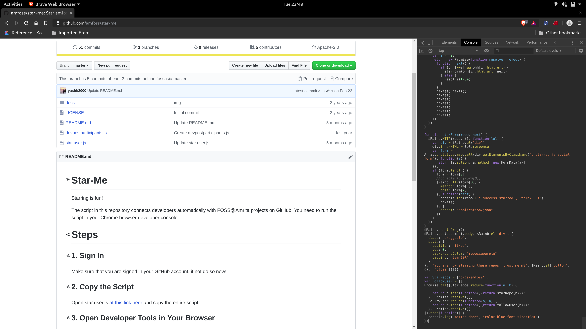
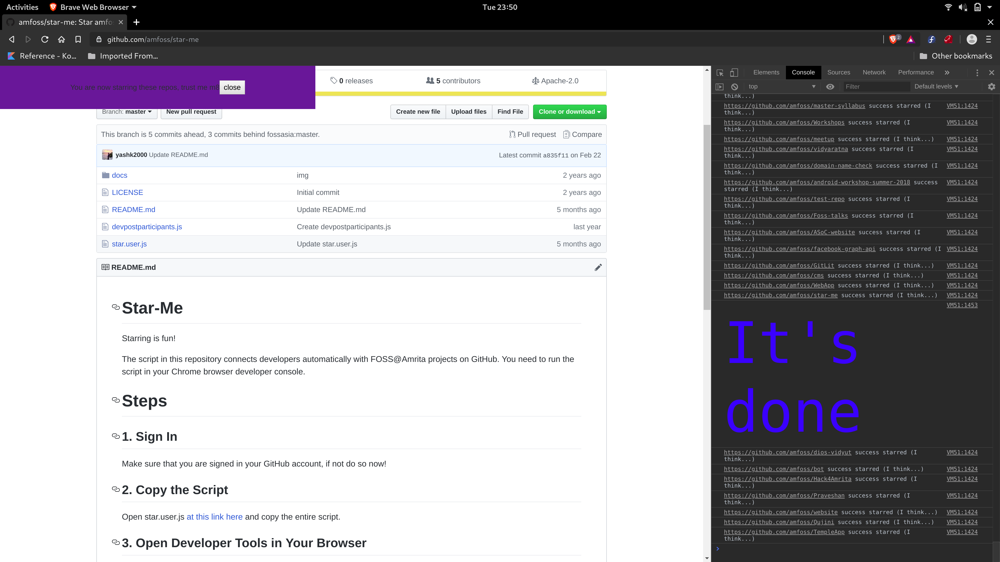

# Star-Me
Starring is fun!

The script in this repository connects developers automatically with FOSS@Amrita projects on GitHub. You need to run the script in your Chrome browser developer console.

# Steps

## 1. Sign In
Make sure that you are signed in your GitHub account, if not do so now!

## 2. Copy the Script
Open star.user.js [use this link](https://raw.githubusercontent.com/amfoss/star-me/master/star.user.js) and copy the entire script.

## 3. Open Developer Tools in Your Browser

Make sure you are on a tab with an open GitHub page and open developer tools.

### For Linux and Windows Users
To open developer tools on Chrome/Chromium please press <kbd>ctrl</kbd>+<kbd>shift</kbd>+<kbd>I</kbd>

### For macOS Users using Chrome/Chromium
To open developer tools please press <kbd>⌘</kbd>+<kbd>⌥</kbd>+<kbd>I</kbd>

**It should look something like this**

## 4. Open the Console tab in the Developer Tools
Click on the `Console` tab in the developer tools to open it, then click on the text area in the Console tab.

Ensure you are still on a browser tab that has GitHub open.

## 5. Paste the Script
Paste the script by pressing <kbd>ctrl</kbd>+<kbd>V</kbd> if you are on Windows or if you are on macOS press <kbd>⌘</kbd>+<kbd>V</kbd>.

Then hit <kbd>return</kbd> / <kbd>Enter</kbd>.

## 6. Wait until the script is finished
The script needs to run a few minutes. At the end it will display "It's done." in blue color. Ensure it runs until the end.

Thank you FOSSASIA for this awesome script!!
The link to the original script can be found [here](https://github.com/fossasia/star-me).
